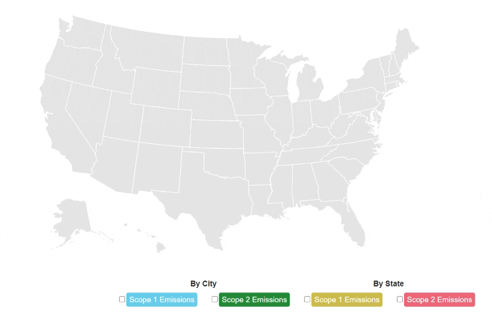
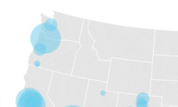

# ghg_map

This is a repository for a data visualization I created using D3.js. The data comes from a survey conducted in 2019 by the Carbon Disclosure Project (CDP). In the survey the CDP collected Scope 1, Scope 2, and Scope 3 data. I focused on Scope 1 and Scope 2 data. 

The EPA defines Scope 1 emissions as "direct emissions from sources that are owned or controlled by the Agency" and Scope 2 emissions as "indirect emissions from sources that are owned or controlled by the Agency."

To create the visualization  I rendered an svg map of the US using the topoJSON library. Then for every US city included in my CSV file from CDP, I plotted a dot on the map using GPS coordinates. Then I made each dot increase in size proportional to the level of  Scope 1 emissions. I repeated this process for Scope 2 emissions by city, Scope 1 emissions by state, and Scope 2 emissions by state. Then I used radio buttons and JavaScript to make the map interactive, so the user can compare the different measurements as they wish.  
  

Some tooltips are always a good idea. Otherwise it's just a big map of context-less bubbles. 
  

The data itself didn't really draw any scandalous conclusions. New York, Texas, California, and the Rust Belt states were the worst polluters. However this was a great way to practice with D3. 